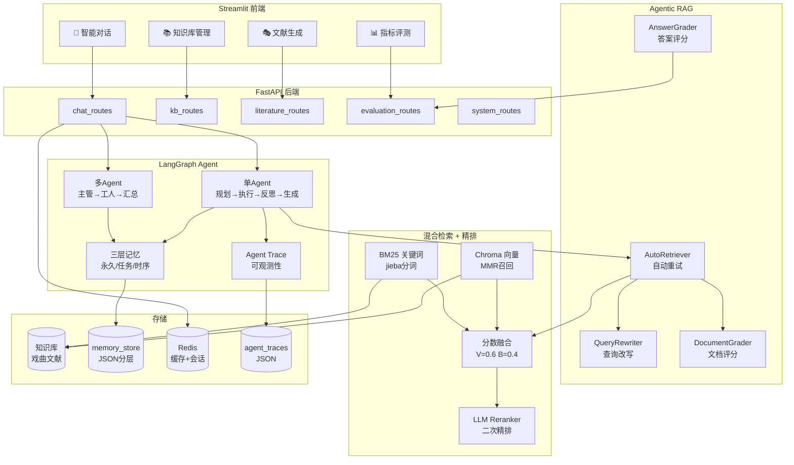
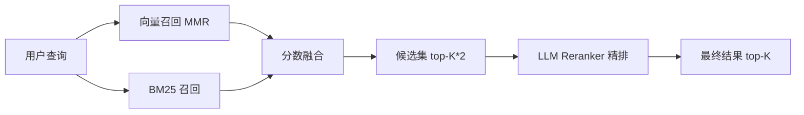
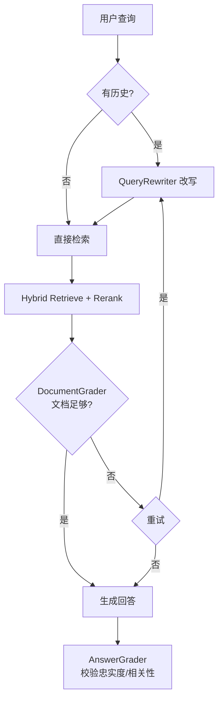
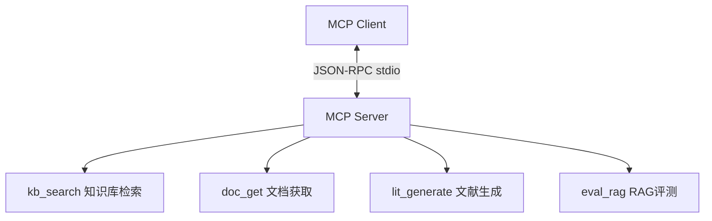

# 🏗️ RAG 知识库智能平台 - 架构设计

## 一、系统总体架构



## 二、分层隔离记忆架构

```mermaid
graph LR
    subgraph 认知抽象[cognitive/统一认知记忆]
        SW[Semantic Memory<br/>语义记忆]
        EP[Episodic Memory<br/>情景记忆]
        WRK[Working Memory<br/>工作记忆]
    end

    subgraph 物理存储[物理存储层 - JSON]
        PM[permanent_memory.json<br/>系统规则/领域规范/用户偏好]
        TM[tasks/{task_id}.json<br/>任务需求/中间产物/约束]
        SM[sessions/{session_id}.json<br/>对话轨迹/工具调用/报错]
    end

    SW --> PM
    EP --> TM
    WRK --> SM

    subgraph 特性[记忆特性]
        F1[全局共享]
        F2[任务隔离/父子嵌套]
        F3[时间戳/自动归档]
    end

    PM --> F1
    TM --> F2
    SM --> F3
```

## 三、Hybrid Search 召回-融合-精排流水线



## 四、Agentic RAG 自动检索重试流程



## 五、MCP Server 工具



## 六、代码目录

```
├── agent/
│   ├── graph_base.py          # 单Agent（含Trace集成）
│   ├── multi_agent.py         # 多Agent
│   ├── trace.py               # 🆕 Agent Trace/Observability
│   └── memory/
│       ├── permanent_memory.py    # 永久静态记忆
│       ├── task_memory.py         # 任务级记忆
│       ├── session_memory.py      # 会话时序记忆
│       ├── memory_manager.py      # 内存管理器（旧）
│       └── unified_memory.py      # 🆕 Working/Episodic/Semantic 抽象
├── rag/
│   ├── reranker/              # 🆕 Reranker 精排模块
│   │   ├── llm_reranker.py
│   │   └── __init__.py
│   ├── agentic/               # 🆕 Agentic RAG 组件
│   │   ├── query_rewriter.py  # 查询改写
│   │   ├── document_grader.py # 文档相关性评分
│   │   ├── answer_grader.py   # 答案质量评分
│   │   └── auto_retriever.py  # 自动检索重试
│   └── vectorstore/
│       └── hybrid_search.py   # 已接入 Reranker 精排
├── evaluation/
│   ├── metrics_evaluator.py   # 基础指标（Recall/HitRate/MRR/NDCG）
│   └── advanced_evaluator.py  # 🆕 高级指标（Faithfulness/Relevance/Precision/Recall/TaskSuccess）
├── mcp_server/                # 🆕 MCP Server
│   └── rag_tools_mcp.py
├── tests/                     # 🆕 测试套件
│   ├── test_reranker.py
│   ├── test_agentic.py
│   ├── test_trace.py
│   └── test_mcp.py
└── config.py                  # 新增 Reranker 配置
```

## 七、指标评测体系

| 层级 | 指标 | 说明 |
|------|------|------|
| 基础检索 | Recall@K / HitRate@K / MRR@K / NDCG@K | 检索质量 |
| 高级RAG | Faithfulness | 答案忠实度（无幻觉） |
| 高级RAG | Answer Relevance | 答案是否直接回答 |
| 高级RAG | Context Precision | 相关文档排序靠前程度 |
| 高级RAG | Context Recall | 相关文档是否都被召回 |
| Agent | Agent Task Success | 端到端任务成功率 |